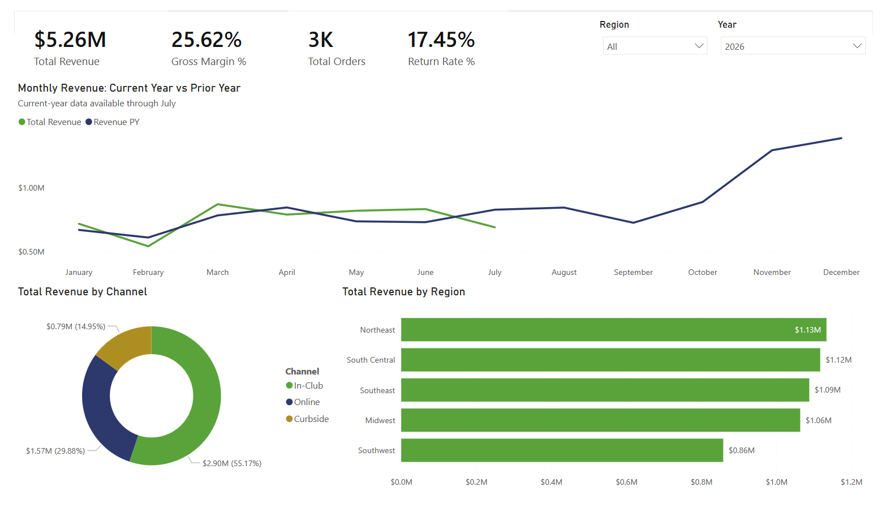
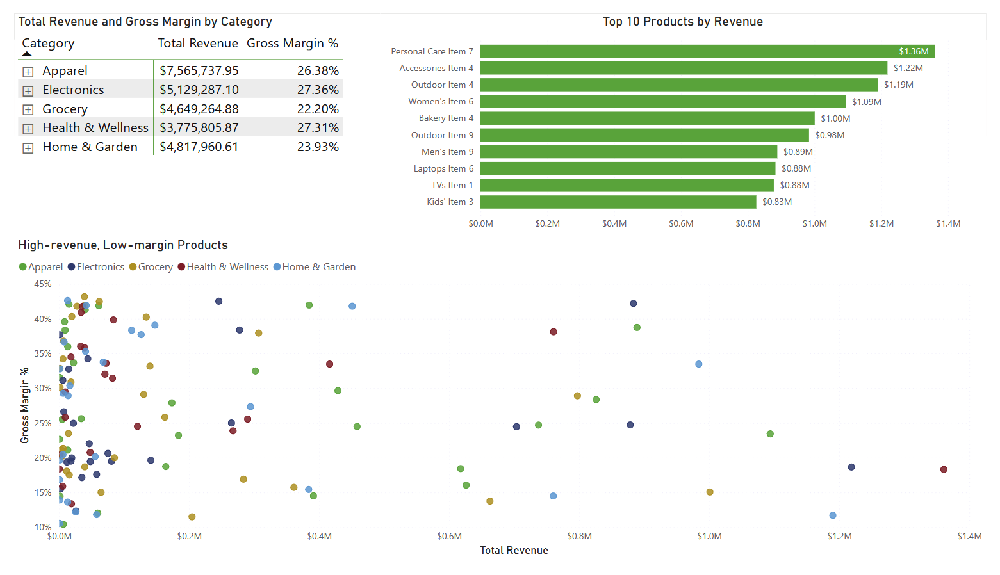
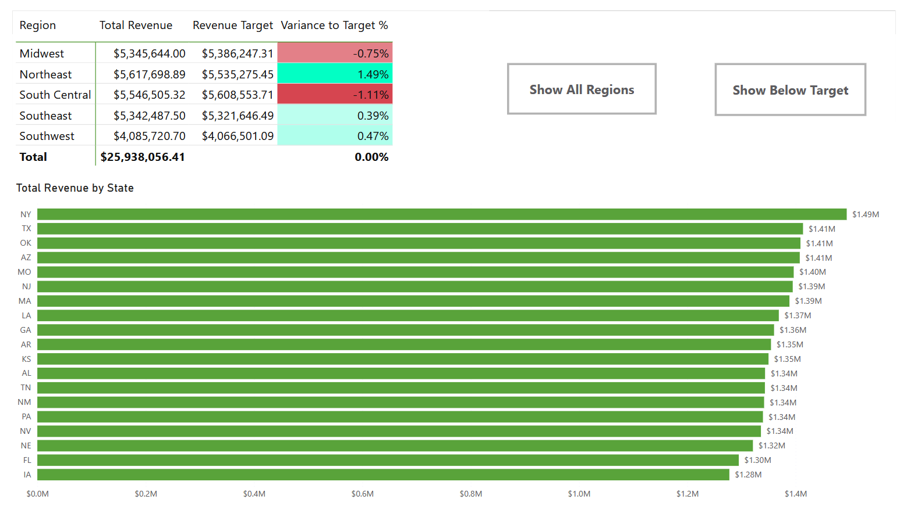
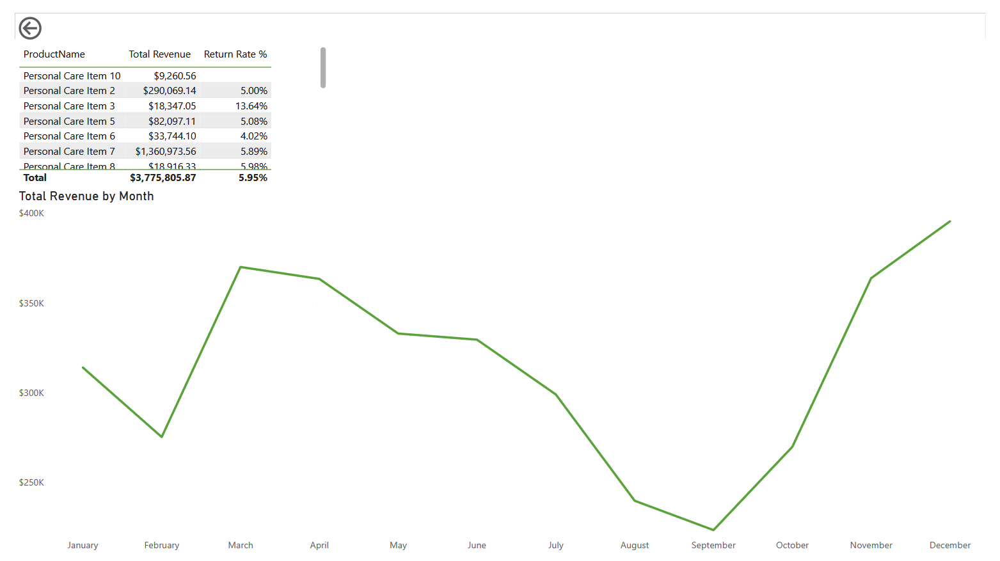

# Power BI Sales Performance Dashboard

Interactive executive dashboard covering revenue, gross margin, orders, return rate, regional performance, and channel mix.

**[View the live interactive report](PASTE-LINK)**

## Dashboard views

### Executive summary

### Product performance

### Regional performance

### Product Detail

## What it does
- Revenue, gross margin, total orders, return rate, and prior-year comparison as DAX measures
- Variance-to-target reporting against revenue goals
- Product, category, regional, and channel views
- Product-level drill-through and bookmark-based filtering

## How it was built
- **Power Query** — data cleaning, transformation, and shaping
- **Data modeling** — star schema with fact and dimension tables
- **DAX** — KPI measures, time intelligence, variance calculations
- **Report design** — executive summary page plus drill-through detail pages

## Dataset
Synthetic retail-sales data generated for portfolio and learning purposes. It contains no real company, customer, or transaction data.

## Files
- `sales-dashboard.pbix` — the Power BI file
- `/screenshots` — dashboard page previews
